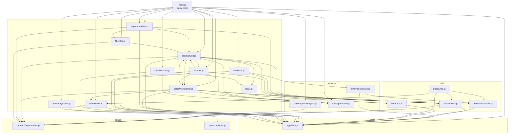
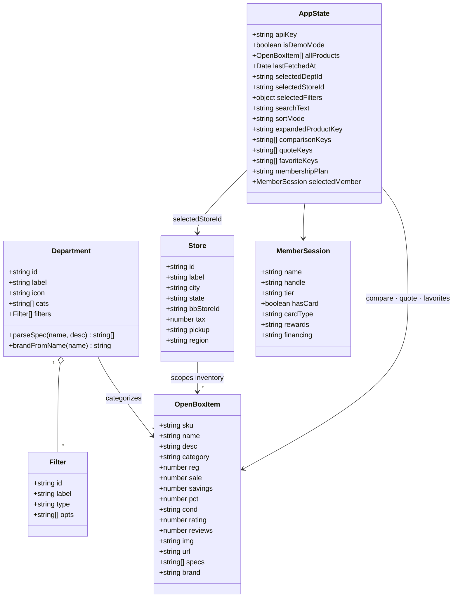
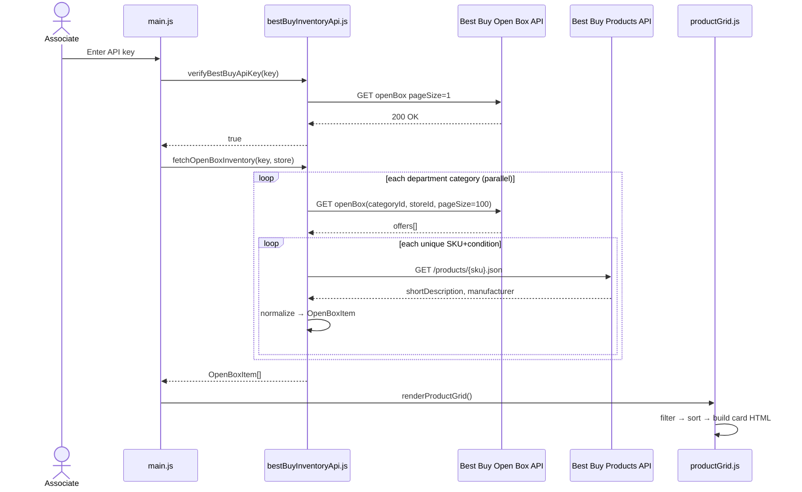
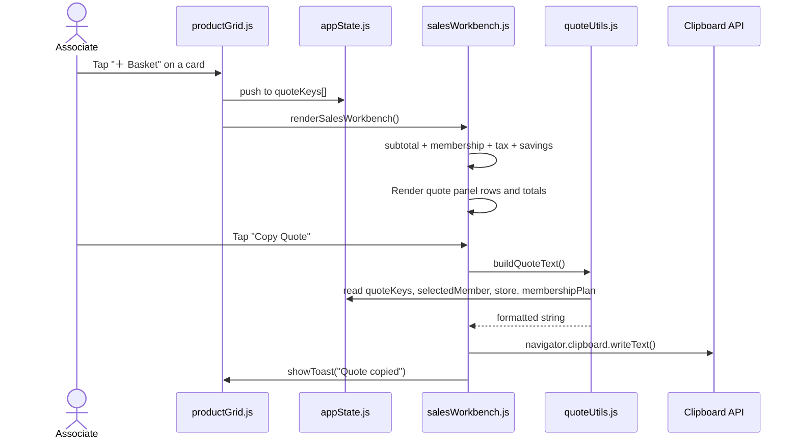
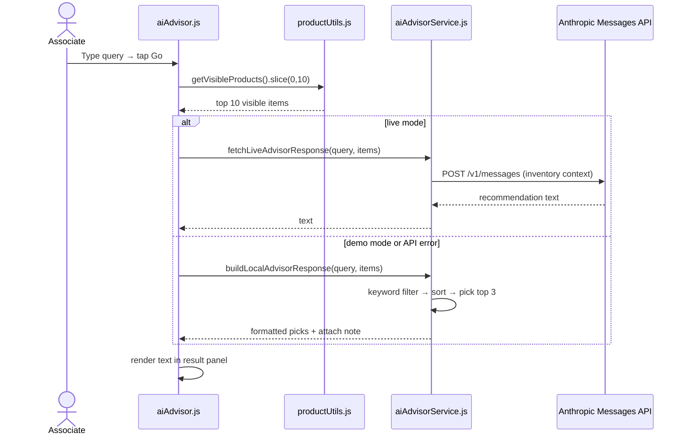
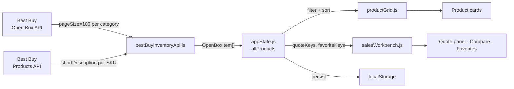

# BB Open Box Finder

A progressive web app for Best Buy store associates to surface, filter, and pitch open box deals in real time. Hooks into the Best Buy Open Box API and the Anthropic Messages API.

---

## What it does

Associates land on a grid of open box deals scoped to their store. They can filter by department, brand, condition, price range, and sort by savings or rating. Tapping a card expands coaching notes tailored to the condition tier — what to lead with, how to anchor on the savings, what to acknowledge upfront. From there they can add items to a comparison tray, build a customer basket, run the AI advisor for a quick recommendation, and copy a full quote with tax and membership math to their clipboard.

The sales workbench on the right pulls together member lookup (demo), membership attach (Plus vs Total), Best Buy Card financing/rewards math, the compare tray, the quote basket, and a favorites list that persists across sessions.

---

## Module Map

```
src/scripts/
  main.js                         entry point — cross-cutting events, app startup
  state/
    appState.js                   singleton state object imported everywhere
  config/
    productDepartments.js         department tabs, category IDs, filters, spec parsers
    storeLocations.js             store IDs, tax rates, pickup context
  data/
    sampleOpenBoxItems.js         demo catalog — used when no API key is present
  services/
    bestBuyInventoryApi.js        Best Buy Open Box + Products API calls
    aiAdvisorService.js           Anthropic Messages API + local keyword fallback
    storageService.js             all localStorage keys in one place
  utils/
    productUtils.js               filtering, sorting, keying — no DOM access
    membershipUtils.js            plan cost, name, and benefits
    htmlUtils.js                  escapeHtml, active filter chips
    quoteUtils.js                 clipboard text builders for quote and favorites
  ui/
    toast.js                      showToast with optional action button
    storePanel.js                 store dropdown and summary card
    inventoryStatus.js            live / sample data indicator
    departmentNav.js              department tab switching
    filterBar.js                  filter pills and sort select
    productGrid.js                card grid, card HTML builder, card actions
    salesWorkbench.js             member, attach, card offer, compare, quote, favorites
    modals.js                     LPN info modal and favorites pop-up
    aiAdvisor.js                  AI overlay event wiring
    installPrompt.js              PWA install prompt and service worker registration
```

---

## Architecture Diagrams

### Module Dependency Graph



### Domain Model



### Live Inventory Sequence



### Quote Build Flow



### AI Advisor Flow



---

## Data Flow Overview



---

## Key Design Decisions

**Single state object.** All mutable app state lives in `state/appState.js` as a plain object imported by any module that needs it. No prop-drilling, no event bus, no framework overhead. Mutating `state.quoteKeys` anywhere immediately reflects in the next render call.

**Services have no DOM access.** `services/` modules only do network calls and storage reads. They can be tested independently or swapped out — e.g. when Best Buy provides their real API endpoint, only `bestBuyInventoryApi.js` changes.

**UI modules call each other directly.** `productGrid.js` and `salesWorkbench.js` import from each other for re-renders after state changes. ES modules handle circular imports fine because the actual calls happen inside function bodies at runtime, not at load time.

**AI advisor has a local fallback.** `aiAdvisorService.js` exports both `fetchLiveAdvisorResponse` (Anthropic API) and `buildLocalAdvisorResponse` (keyword-based). Demo mode and API failures both land on the local path — no broken UI, no empty state.

**Adding a store or department touches one file.** New stores go in `config/storeLocations.js`. New departments go in `config/productDepartments.js` with their own `cats`, `filters`, `parseSpec`, and `brandFromName`. Nothing else needs to change.
