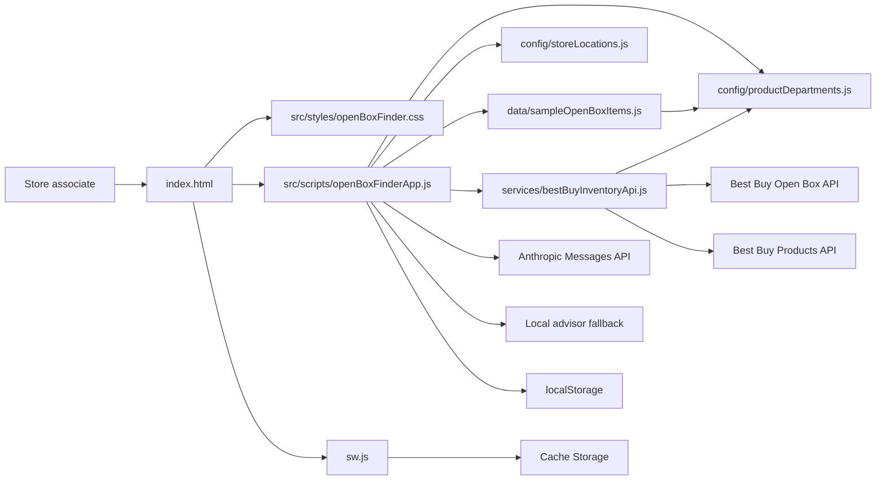
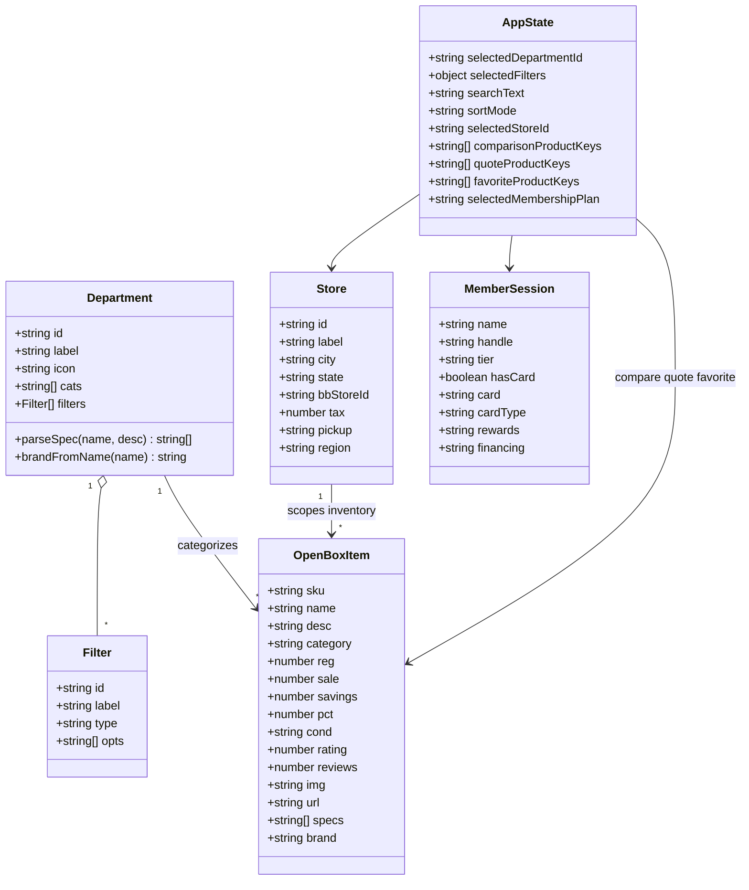
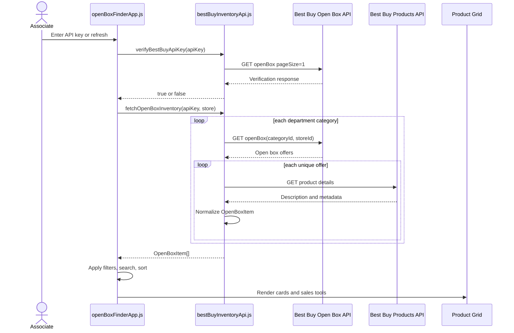
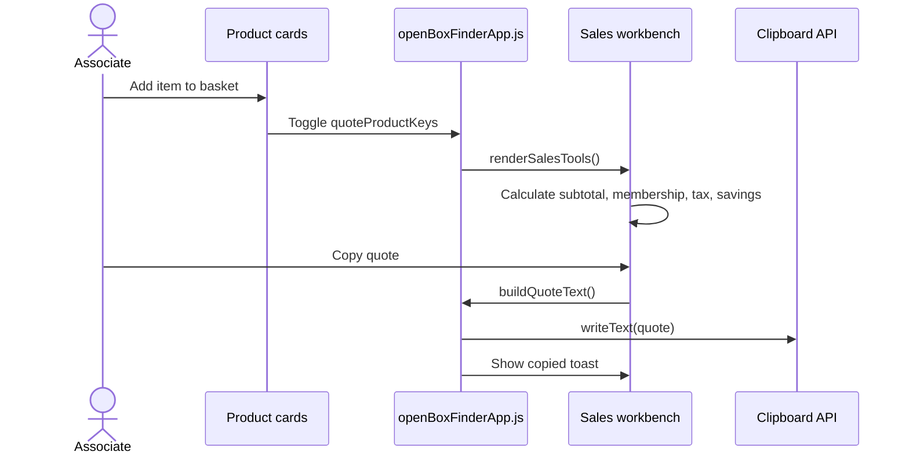

# Open Box Finder UML Diagrams

These Mermaid diagrams document the refactored static app structure.

## Component Diagram

```mermaid
flowchart LR
  User["Store associate"] --> Shell["index.html"]
  Shell --> Styles["src/styles/openBoxFinder.css"]
  Shell --> App["src/scripts/openBoxFinderApp.js"]
  Shell --> SW["sw.js"]

  App --> Departments["config/productDepartments.js"]
  App --> Stores["config/storeLocations.js"]
  App --> DemoData["data/sampleOpenBoxItems.js"]
  App --> BestBuyApi["services/bestBuyInventoryApi.js"]

  DemoData --> Departments
  BestBuyApi --> Departments
  BestBuyApi --> BBOpenBox["Best Buy Open Box API"]
  BestBuyApi --> BBProducts["Best Buy Products API"]
  App --> Anthropic["Anthropic Messages API"]
  App --> LocalAdvisor["Local advisor fallback"]
  App --> BrowserStorage["localStorage"]
  SW --> CacheStorage["Cache Storage"]
```

## Domain Class Diagram

```mermaid
classDiagram
  class Department {
    +string id
    +string label
    +string icon
    +string[] cats
    +Filter[] filters
    +parseSpec(name, desc) string[]
    +brandFromName(name) string
  }

  class Filter {
    +string id
    +string label
    +string type
    +string[] opts
  }

  class Store {
    +string id
    +string label
    +string city
    +string state
    +string bbStoreId
    +number tax
    +string pickup
    +string region
  }

  class OpenBoxItem {
    +string sku
    +string name
    +string desc
    +string category
    +number reg
    +number sale
    +number savings
    +number pct
    +string cond
    +number rating
    +number reviews
    +string img
    +string url
    +string[] specs
    +string brand
  }

  class MemberSession {
    +string name
    +string handle
    +string tier
    +boolean hasCard
    +string card
    +string cardType
    +string rewards
    +string financing
  }

  class AppState {
    +string selectedDepartmentId
    +object selectedFilters
    +string searchText
    +string sortMode
    +string selectedStoreId
    +string[] comparisonProductKeys
    +string[] quoteProductKeys
    +string[] favoriteProductKeys
    +string selectedMembershipPlan
  }

  Department "1" o-- "*" Filter
  Department "1" --> "*" OpenBoxItem : categorizes
  Store "1" --> "*" OpenBoxItem : scopes inventory
  AppState --> Store
  AppState --> MemberSession
  AppState --> OpenBoxItem : compare quote favorite
```

## Live Inventory Sequence

```mermaid
sequenceDiagram
  actor Associate
  participant App as openBoxFinderApp.js
  participant Api as bestBuyInventoryApi.js
  participant OpenBox as Best Buy Open Box API
  participant Products as Best Buy Products API
  participant UI as Product Grid

  Associate->>App: Enter API key or refresh
  App->>Api: verifyBestBuyApiKey(apiKey)
  Api->>OpenBox: GET openBox pageSize=1
  OpenBox-->>Api: Verification response
  Api-->>App: true or false

  App->>Api: fetchOpenBoxInventory(apiKey, store)
  loop each department category
    Api->>OpenBox: GET openBox(categoryId, storeId)
    OpenBox-->>Api: Open box offers
    loop each unique offer
      Api->>Products: GET product details
      Products-->>Api: Description and metadata
      Api->>Api: Normalize OpenBoxItem
    end
  end
  Api-->>App: OpenBoxItem[]
  App->>App: Apply filters, search, sort
  App->>UI: Render cards and sales tools
```

## Quote Flow

```mermaid
sequenceDiagram
  actor Associate
  participant Grid as Product cards
  participant App as openBoxFinderApp.js
  participant Sales as Sales workbench
  participant Clipboard as Clipboard API

  Associate->>Grid: Add item to basket
  Grid->>App: Toggle quoteProductKeys
  App->>Sales: renderSalesTools()
  Sales->>Sales: Calculate subtotal, membership, tax, savings
  Associate->>Sales: Copy quote
  Sales->>App: buildQuoteText()
  App->>Clipboard: writeText(quote)
  App->>Sales: Show copied toast
```
